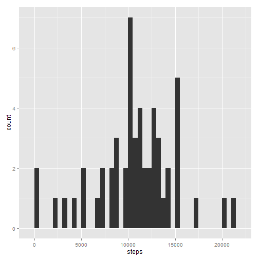
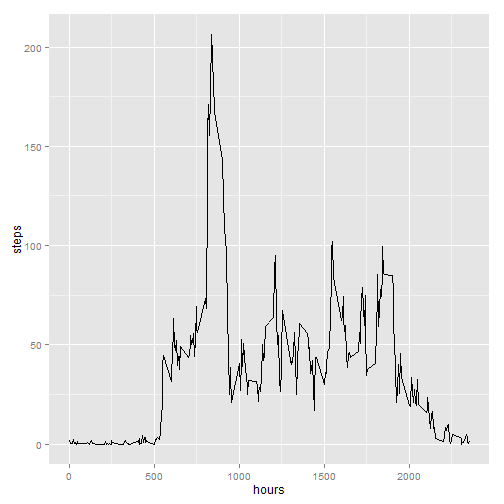

# Reproducible Research: Peer Assessment 1


## Loading and preprocessing the data


```r
unzip("activity.zip")
activities <- read.csv("activity.csv")
activities <- transform(activities, date <- factor(date), interval <- factor(interval))
```


## What is mean total number of steps taken per day?

A histogram of the total number of steps taken each day:


```r
library(ggplot2)
validActivities <- na.omit(activities)
stepsFrame <- aggregate(steps ~ date, data = validActivities, FUN = sum)
ggplot(stepsFrame, aes(x=steps)) + geom_histogram(binwidth = 500)
```

 

The mean total number of steps is:


```r
mean(stepsFrame$steps)
```

[1] 10766

The median total number of steps is:


```r
median(stepsFrame$steps)
```

[1] 10765


## What is the average daily activity pattern?


```r
stepsTimeSeriesFrame <- aggregate(steps ~ interval, data = activities, FUN = mean)
stepsTimeSeriesFrame$formattedInterval <- with(stepsTimeSeriesFrame, formatC(interval, width = 4, format = "d", flag = "0"))
rowIndexOfMaxSteps <- with(stepsTimeSeriesFrame, which.max(steps))
maxInterval <- stepsTimeSeriesFrame[rowIndexOfMaxSteps,]$formattedInterval
ggplot(stepsTimeSeriesFrame, aes(x = interval, y = steps)) + geom_line() + xlab("hours")
```

 

The 5-minute interval, on average across all days, containing the maximum number of steps happens at **0835 hrs**


## Inputing missing values


## Are there differences in activity patterns between weekdays and weekends?
