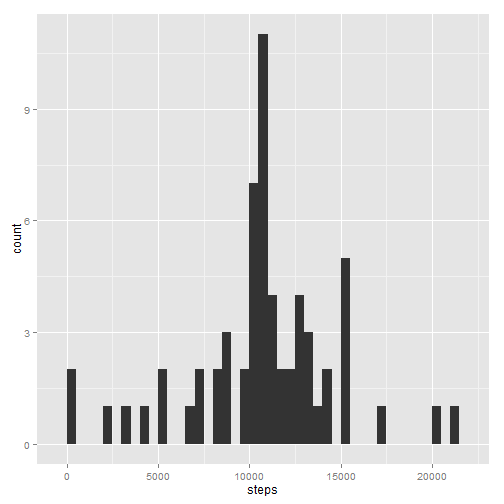

# Reproducible Research: Peer Assessment 1


## Loading and preprocessing the data


```r
unzip("activity.zip")
activities <- read.csv("activity.csv")
activities <- transform(activities, date <- factor(date), interval <- factor(interval))
```


## What is mean total number of steps taken per day?

A histogram of the total number of steps taken each day:


```r
library(ggplot2)
validActivities <- na.omit(activities)
stepsFrame <- aggregate(steps ~ date, data = validActivities, FUN = sum)
ggplot(stepsFrame, aes(x=steps)) + geom_histogram(binwidth = 500)
```

 


```r
stepMean <- mean(stepsFrame$steps)
stepMedian <- median(stepsFrame$steps)
```


The mean total number of steps is: 10766.19


The median total number of steps is: 10765


## What is the average daily activity pattern?


```r
stepsTimeSeriesFrame <- aggregate(steps ~ interval, data = activities, FUN = mean)
stepsTimeSeriesFrame$formattedInterval <- with(stepsTimeSeriesFrame, formatC(interval, width = 4, format = "d", flag = "0"))
rowIndexOfMaxSteps <- with(stepsTimeSeriesFrame, which.max(steps))
maxInterval <- stepsTimeSeriesFrame[rowIndexOfMaxSteps,]$formattedInterval
ggplot(stepsTimeSeriesFrame, aes(x = interval, y = steps)) + geom_line() + xlab("hours")
```

 

The 5-minute interval, on average across all days, containing the maximum number of steps happens at **0835 hrs**


## Inputing missing values


```r
numMissingValues <- sum(is.na(activities$steps))
```

There are 2304 missing values from the original dataset.  

In place of the missing values, we fill in the mean of those 5-minute intervals.


```r
stepsAndIntervals <- activities[, c('steps', 'interval')]
processedSteps <- function(row) {
  if(is.na(row['steps'])) {
    interval <- row['interval']
    #Find the mean for that interval across all days
    stepsTimeSeriesFrame[stepsTimeSeriesFrame$interval == interval, 'steps']
  }
  else {
    #Retain the steps, since it is not a missing value
    row['steps']
  }
}
#Fill in the processed steps value for each activity row
processedActivities <-  data.frame(steps = apply(stepsAndIntervals, 1, processedSteps), interval = activities$interval, date = activities$date)
```

The histogram for the number of steps now looks like:


```r
stepsFrameProcessed <- aggregate(steps ~ date, data = processedActivities, FUN = sum)
ggplot(stepsFrameProcessed, aes(x=steps)) + geom_histogram(binwidth = 500)
```

 


```r
stepMeanProcessed <- mean(stepsFrameProcessed$steps)
stepMedianProcessed <- median(stepsFrameProcessed$steps)
```

The mean total number of steps is: 10766.19


The median total number of steps is: 10766.19


There is no difference in the means obtained before and after filling the missing values.
The median shows a difference of 1.19. Hence, we could say that there is only a very little impact due to filling up of the missing value using the strategy we chose earlier.


## Are there differences in activity patterns between weekdays and weekends?

First, we categorize each activity measurement as a weekday or a weekend.


```r
dayOfWeek <- with(processedActivities, weekdays(as.Date(date)))
processedActivities$dayType <- sapply(dayOfWeek, FUN = function(x) if (x %in% c("Saturday", "Sunday")) "weekend" else "weekday" )
processedActivities <- transform(processedActivities, dayType <- factor(dayType))
```

Next, we compare the activity patterns between weekdays and weekends.


```r
stepsTimeSeriesFrameProcessed <- aggregate(steps ~ interval + dayType, data = processedActivities, FUN = mean)
stepsTimeSeriesFrameProcessed$formattedInterval <- with(stepsTimeSeriesFrameProcessed, formatC(interval, width = 4, format = "d", flag = "0"))
ggplot(stepsTimeSeriesFrameProcessed, aes(x = interval, y = steps)) + geom_line() + xlab("hours") + facet_grid(dayType ~ .)
```

 

We can see that during weekdays, the activity is quite high during morning hours - whereas during weekends, the activity is more spread out.
